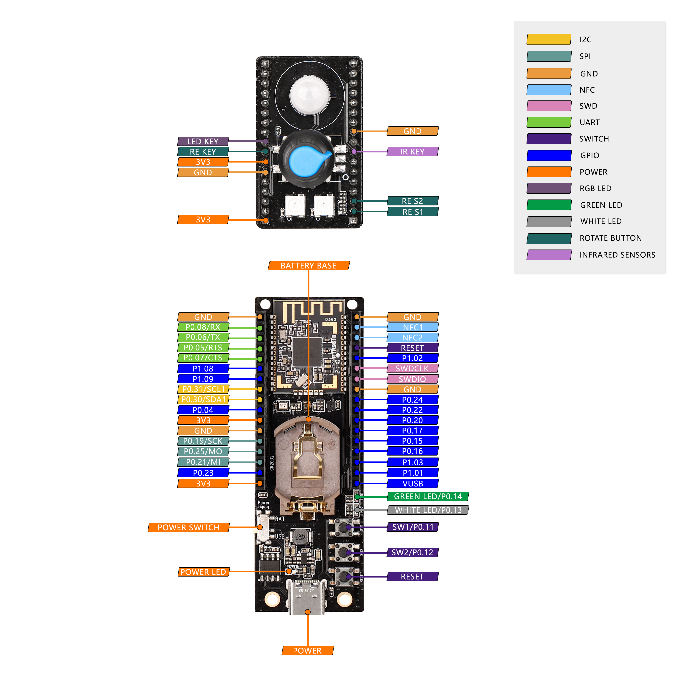

[TOC]

# GL Thread Dev Board

Thread Dev Board (TBD) is the end device part of the thread kit developed by GL-iNet. Developers can test thread-related features and develop their own features based on the TBD.

TBD currently implements the following functions:

- Join a thread network as a **Thread Router** / **Thread End Device** / **Thread Sleepy End Device**.
- Real-time collection of current environment information and uploading to S200 gateway via thread.
    - Temperature 
    - Humidity 
    - Air pressure
    - Pyroelectric infrared
    - Rotary encoder status
    - GPIO input
- Receive command and execute operations in real time via thread
    - RGB LED on/off
    - Change RGB LED color
    - GPIO output
- Firmware upgrade
    - DFU by UART
    - DFU by thread

## HW Info

| HW part                             | Info                          |
| ----------------------------------- | ----------------------------- |
| MCU                                 | NRF52840                      |
| Temperature and humidity sensor     | SHTC3                         |
| Light sensor                        | HX3203                        |
| Air pressure and temperature sensor | SPL0601                       |
| Pyroelectric infrared sensor        | XYC-PIR203B-S0                |
| Rotary encoder                      | EC1108                        |
| RGB LED (X2)                        | LC8812B                       |
| SW define button                    | x2                            |
| HW reset button                     | x1                            |
| SW define LED                       | x2                            |
| HW power LED                        | x1                            |
| Power supply                        | Battery base(CR2032) / Type-C |

## Pinout



## SW Development Environment

### 1.Download gl-nrf-sdk (branch:v2.0-glinet) 

```
west init -m https://github.com/gl-inet/gl-nrf-sdk --mr v2.2.0-glinet gl-nrf-sdk
```

### 2.Update download dependency

```
cd gl-nrf-sdk/
west updat
```

### 3.Buiding gl-dev-board-over-thread demo 

​	gl-dev-board-over-thread demo is used as an example.

#### (1)buiding

```
cd glinet/gl-dev-board-over-thread
west build -b gl_nrf52840_dev_board 
```

####    (2)Flashing

​	GL Thread DEV Board is connected to ubuntu by J-LINK burner, and flashing the firmware to GL Thread DEV Board.

```
west flash --erase
```

####    (3)test

​	Reference https://docs.gl-inet.com/en/4/user_guide/gl-s200/gl_dev_board/ add TDB(GL Thread DEV Board) to the thread network.After successfully joining the network, you can view the collected data such as temperature reported by the OTB to gl-s200 on the web page, or run commands in the background of gl-s200 to control the OTB.

##### Set LED switch

Off

```shell
coap_cli -N -e "{\"cmd\":\"onoff\",\"obj\":\"all\",\"val\":0}" -m put coap://[fd11:22:0:0:240f:8ae:bbca:47c2]/cmd
{"err_code":0}
```

On

```shell
coap_cli -N -e "{\"cmd\":\"onoff\",\"obj\":\"all\",\"val\":1}" -m put coap://[fd11:22:0:0:240f:8ae:bbca:47c2]/cmd
{"err_code":0}
```

On and off with delay

```plaintext
coap_cli -N -e "{\"cmd\":\"onoff\",\"obj\":\"all\",\"val\":1,\"delay\":10}" -m put coap://[fd11:22:0:0:240f:8ae:bbca:47c2]/cmd
{"err_code":0}
```

toggle

```shell
coap_cli -N -e "{\"cmd\":\"onoff\",\"obj\":\"all\",\"val\":2}" -m put coap://[fd11:22:0:0:45a7:d69c:3f32:614a]/cmd
{"err_code":0}
```

##### Set LED color

Note: It is effective only when the LED is on

```shell
coap_cli -N -e "{\"cmd\":\"change_color\",\"obj\":\"all\",\"r\":230,\"g\":230,\"b\":230}" -m put coap://[fd11:22:0:0:256:d4d4:98e2:2bf0]/cmd
{"err_code":0}
```

##### Set the GPIO level

```shell
coap_cli -N -e "{\"cmd\":\"set_gpio\",\"obj\":\"0.15\",\"val\":false}" -m put coap://[fd11:22:0:0:26e6:c63b:4a02:49d6]/cmd
{"err_code":0}
```

```shell
coap_cli -N -e "{\"cmd\":\"set_gpio\",\"obj\":\"0.15\",\"val\":true}" -m put coap://[fd11:22:0:0:26e6:c63b:4a02:49d6]/cmd
{"err_code":0}
```

##### Read the GPIO status

```shell
root@GL-S200:~# coap_cli -N -e "{\"cmd\":\"get_gpio_status\"}" -m put coap://[fd11:22:0:0:12c7:ca49:90c5:d269]/cmd
{"gpio_status":[{"obj":"0.15","val":0},{"obj":"0.16","val":0},{"obj":"0.17","val":0},{"obj":"0.20","val":0}],"err_code":0}
```

##### Read LED status

```shell
root@GL-S200:~# coap_cli -N -e "{\"cmd\":\"get_led_status\"}" -m put coap://[fd11:22:0:0:12c7:ca49:90c5:d269]/cmd
{"led_strip_status":[{"obj":"led_left","on_off":0,"r":0,"g":0,"b":0},{"obj":"led_left","on_off":0,"r":0,"g":0,"b":0}],"err_code":0}
```

### 4.Buiding  other demo 

​	cli demo is used as an example.

#### (1)buiding

​	Enter cli demo directory and building

```
cd gl-nrf-sdk/nrf/samples/openthread/cli
west build -b gl_nrf52840_dev_board
```

​	The following print appears if the compilation is successful

```
[664/672] Linking CXX executable zephyr/zephyr.elf
Memory region         Used Size  Region Size  %age Used
           FLASH:      387604 B     495104 B     78.29%
             RAM:      106552 B       256 KB     40.65%
        IDT_LIST:          0 GB         2 KB      0.00%
[667/672] Generating ../../zephyr/app_update.bin
sign the payload
[669/672] Generating ../../zephyr/app_signed.hex
sign the payload
[670/672] Generating ../../zephyr/app_test_update.hex
sign the payload
[672/672] Generating zephyr/merged.hex

```

####   (2)Flashing	

​	GL Thread DEV Board is connected to ubuntu by J-LINK burner, and flashing the firmware to GL Thread DEV Board.

```
west flash --erase
```

​	If the flashing success will appear the following print

```
[ #################### ]  20.244s | Erase file - Done erasing                                                          
[ #################### ]   5.791s | Program file - Done programming                                                    
[ #################### ]   6.453s | Verify file - Done verifying                                                       
Enabling pin reset.
Applying pin reset.
-- runners.nrfjprog: Board with serial number 59768885 flashed successfully.
```

####    (3)test

​	Enter cli command in GL development board terminal to test.

```
uart:~$ ot channel 11
Done
uart:~$ ot panid 0xabcd
Done
uart:~$ ot networkkey 00112233445566778899aabbccddeeff
Done
uart:~$ ot ifconfig up
Done
uart:~$ ot thread start
Done
uart:~$ ot state
leader
Done
uart:~$ ot networkname
ot_zephyr
Done
uart:~$ ot ipaddr
fdde:ad00:beef:0:0:ff:fe00:fc00
fdde:ad00:beef:0:0:ff:fe00:2000
fdde:ad00:beef:0:6664:a2c4:e0c3:9772
fe80:0:0:0:100a:90e1:b44:8bc
Done
uart:~$ ot dataset active -x
0e080000000000000000000300000b35060004001fffe00208dead00beef00cafe0708fddead00beef0000051000112233445566778899aabbccddeeff03096f745f7a65706879720102abcd04104407e0cbde217a7be71da8da414913cd0c0402a0f7f8
Done
```

​	

