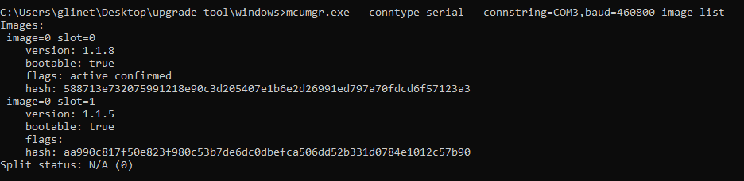

# UART_DFU

Upgrade gl_thread_dev_board firmware based on UART.

## **Upgrade Preparation**

1. Firmware: GL-Thread-Dev-Board-FTD-OTA-v1.1.9.bin

    *You can find our release firmware [here](../release)*
2. Upgrade program: mcumgr.exe
3. Windows PC

We currently provide mcumgr binaries based on **window10** and **Ubuntu 22.04**. If you are using a different system, please contact us or compile mcumgr yourself.

## **Upgrade Steps**

### **Step 1: Connect the Device and Check the Port**

Connect your development board to the PC and confirm the serial port number of the current development board, as shown in the figure below:


The port number of my device is **COM3** currently.

### **Step 2: Check the Device Version**

**Notice: You need to open CMD and run mcumgr.exe from there.**

1. Open the **CMD** and find the path of mcumgr.exe, such as C:\Users\glinet\Desktop\upgrade tool\windows.

2. Enter the command "cd **your path of mcumgr.exe**" to enter the mcumgr path

3. Enter the command  to view the current firmware of the device. 

    ```shell
    mcumgr.exe --conntype serial --connstring=your_board_port,baud=460800 image list
    ```

    

### **Step 3: Upload the Firmware**

```shell
mcumgr.exe --conntype serial --connstring=your_board_port,baud=460800 image upload new_firmware_path
```


### **Step 4: Check the Uploaded Firmware Information**

```shell
mcumgr.exe --conntype serial --connstring=your_board_port,baud=460800 image list
```


### **Step 5: Set the Firmware for next boot**

```shell
mcumgr.exe --conntype serial --connstring=your_board_port,baud=460800 image test new_firmware_hash
```


Make sure the flags of the new firmware is pending.

### Step 6: Reboot

```shell
mcumgr.exe --conntype serial --connstring=your_board_port,baud=460800 reset
```

Or you can simply re-power the board.

### Step 7: Recheck the firmware version

```shell
mcumgr.exe --conntype serial --connstring=your_board_port,baud=460800 image list
```

Check that the upgrade has been completed to version 1.1.9.


